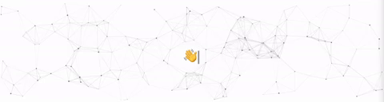

  

I'm currently pursuing a Ph.D. in Computer Science at Northeastern University's Khoury College, under the guidance of [Prof. Yun Raymond Fu](https://www1.ece.neu.edu/~yunfu/) at [Synergetic Media Learning Lab](https://fulab.sites.northeastern.edu/). My research focuses on Computer Vision and Artificial Intelligence. Specifically, my interests include:

* Computer Vision (3D novel-view synthesis (NeRF, NeLF, Gaussian Splatting, etc.); VLMs, multi-modal generations, video and image generation/understanding; diffusion; AIGC)
* Machine Learning (AGI; autonomous driving; embodied AI)
* Natural Language Processing (LLMs)

